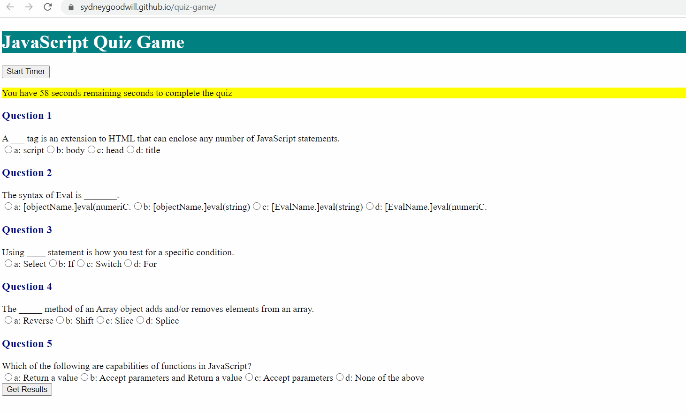

# quiz-game

# Purpose

The purpose of this quiz game is to demonstrate an app that features dynamically updated HTML and CSS powered by JavaScript. This app should also be responsive, ensuring that it adapts to multiple screen sizes. Test your knowledge of JavaScript with this quiz game!

Link to the live site: [Code Quiz Game](https://sydneygoodwill.github.io/quiz-game/)

# GIF

The following animation demonstrates the application functionality:

# URL

https://github.com/SydneyGoodwill/quiz-game/

# Works Cited and Resources

Between helpful peers, many internet searches, some tutorials and sample code, I was able to produce something. I want to point out that my JavaScript questions were pulled from: http://mcqspdfs.blogspot.com/2013/08/60-top-javascript-multiple-choice.html and I also utilized this site for some help on Quiz set up: https://simplestepscode.com/javascript-quiz-tutorial/#step1